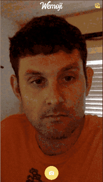

# Wem😆ji

Wemoji is a Progressive Web App that scans for faces in user uploaded photos and matches their detected emotion with their corresponding emoji.

## Features

- Detects multiple faces in Photos, matching their emotions to respective emojis
- Cross-platform: Works on phones & browsers
- Works with images taken from user’s camera, or uploaded images
- Lightweight: 265K payload for entire app _(82.47KB gzipped)_

## Tech Stack

- React
- Redux
- Redux Thunk
- Styled Components
- Ionic v4 Beta Web Components
- Stencil
- Microsoft Face API
- HTML5 Canvas
- HTML5 Media Elements
- Webpack
- Progressive Web App (no install required)!

## Remaining TODOs

- [ ] Allow user to download photo to Photo album // Set the href attribute of the download button, like `document.querySelector('#dl-btn').href = imageDataURL`;
- [ ] Show an error icon if user denies permissions (use ErrorBoundary)

## EXTRAs (these are all things that could be done to improve the app)

- Image filters? ( https://www.html5rocks.com/en/tutorials/getusermedia/intro/ )
- Animations
- PWA tuning (improve service worker caching, offline loading, etc)
